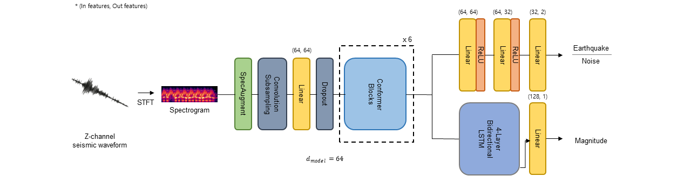

# Conformer-Sesimic

Published: IEEE Geoscience and Remote Sensing Letters(GRSL) in 2024. 

[Paper](https://ieeexplore.ieee.org/abstract/document/10477380) is available in IEEE Xplore.

### Citation
If you use our code or otherwise find this work useful, please cite our paper:

	@ARTICLE{10477380,
	  author={Jin, Yooseok and Kim, Gwantae and Ko, Hanseok},
	  journal={IEEE Geoscience and Remote Sensing Letters}, 
	  title={Classification and Magnitude Estimation of Global and Local Seismic Events Using Conformer and Low-Rank Adaptation Fine-Tuning}, 
	  year={2024},
	  volume={21},
	  number={},
	  pages={1-5},
	  keywords={Earthquakes;Estimation;Adaptation models;Task analysis;Data models;Convolution;Training;Attention;Conformer;convolutional neural network (CNN);deep learning;low-rank adaptation (LoRA);magnitude estimation;seismic event classification},
	  doi={10.1109/LGRS.2024.3379973}}
